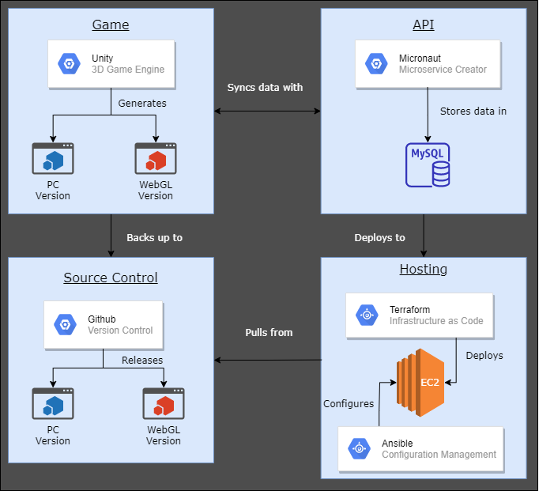

# Game-Systems-Integration

A Simple 2D RPG (Role Playing Game) that combines various game systems.



## How to use this project

If you want to download this project in order to extend/modify it yourself or if you would like to create a build for an OS other than Windows, follow these instructions:

1. Clone or download this project using the green icon near the top of this page.
2. Unzip the project files if downloaded.
3. Open the project in Unity using the Unity Hub.
4. On Unity Hub, select Projects.
5. Then select Add.
6. On the file explorer, find the project you cloned or downloaded then click Select Folder.
7. On Unity Hub, double click on this project's name in the Projects section.
8. Once the project is open, expand the scenes folder and open the Default scene.

---

## Important code helpers being used in this project

- Editor Toolbox - Used for Attributes in the Unity Inspector found here: [Editor Toolbox](https://github.com/arimger/Unity-Editor-Toolbox)
- NaughtyAttributes - Used for Attributes in the Unity Inspector found here: [NaughtyAttributes](https://github.com/dbrizov/NaughtyAttributes)
- Serialized Dictionary Lite - Used to see dictionaries in the Unity Inspector found here: [Serialized Dictionary Lite](https://assetstore.unity.com/packages/tools/utilities/serialized-dictionary-lite-110992)
- JSON Object - Used to convert a GameObject into a JSON object found here: [JSON Object](https://assetstore.unity.com/packages/tools/input-management/json-object-710)
- StandaloneFileBrowser - Used to open a file/folder dialog for the player to select a file/folder during gameplay/saving found here: [Standalone File Browser](https://github.com/gkngkc/UnityStandaloneFileBrowser)

---

## Local Webserver Setup

## Creating a Docker container

- Creates a Docker container, then maps port 80 in the container to port 80 on the host, then maps port 443 in the container to port 443 on the host, then names the container 'webserver', then mounts the folder as '/data', and uses a Ubuntu image.

    ```docker
    docker run -dit -p 80:80 -p 443:443 --name webserver -v C:/Users/h1ddengames/Desktop/Items/Builds/WebGL:/data ubuntu
    ```

## Logging into the Docker container

- Logs into the container using /bin/bash shell

    ```docker
    docker exec -it webserver /bin/bash
    ```

## Stopping the Docker container

- Stops the docker container but does not delete it. Can be restarted at a later time.

    ```docker
    docker stop webserver
    ```

## Deleting the Docker container

- Deletes the Docker container and all the data stored within.

    ```docker
    docker rm webserver
    ```

## Starts the Docker container

- Starts the docker container

    ```docker
    docker start webserver
    ```

## Setting up the server instance

- Updates the package list, then upgrades all currently installed software, and finally installs apache2

    ```bash
    apt update -y && apt upgrade -y && apt install apache2 -y
    ```

## Starting the apache service

- Starts the apache service.

    ```bash
    service apache2 start
    ```

## Moving files to the hosting directory

- Copies recursively and asks if files should be overwritten if the names are the same.

    ```bash
    cp -ir /data/* /var/www/html/
    ```

---

## Cloud Webserver Setup

## Obtaining a Domain

1. Go to Namecheap.
2. Create or login to an account.
3. Add two factor authentication.
4. Search for a domain name.
5. Add the domain to cart.
6. During checkout make sure that WhoisGuard is enabled.
7. Give a false address/phone number just in case.
8. Finish payment and checkout.

## Cloudflare for DNS and HTTPS

1. Go to Cloudflare.
2. Create or login to an account.
3. Add your new Domain.
4. Take the nameservers given and go to Namecheap.
5. Login to Namecheap then go to your domain.
6. Change the DNS nameservers to the nameservers given by Cloudflare.
7. Wait for about 1-2 hours for the nameservers to update.
8. Go back to Cloudflare and refresh the page.
9. Click on DNS then update the ip address to your home public ip.
10. Click on SSL/TLS then select Flexible.
11. Click on Edge Certificates then turn on 'Always Use HTTPS'

## Hosting from home server

1. Open Windows Firewall.
2. Click on Advanced Settings.
3. Click on Inbound Rules.
4. Click on New Rule.
5. Click on Port then Next.
6. Click on TCP and Specific local ports, then enter '80, 443' without the '', finally Next.
7. Click on Allow the connection then Next.
8. Enable for Domain, Private, and Public then Next.
9. Give a name such as 'Webserver' then Finish.
10. Open command prompt and type 'ipconfig' without the ''.
11. Take note of the default gateway and the host computer's ip address.
12. Go to 192.168.0.1 or your default gateway.
13. Login to the gateway.
14. Go to the Port Forwarding Settings.
15. Enter a new rule for forwarding port 80 to port 80 for your host ip address.
16. Enter a new rule for forwarding port 443 to port 443 for your host ip address.
17. Save settings and exit the gateway interface.

## Hosting from AWS

1. Create an AWS account.
2. Add two factor authentication.
3. Login and go to the dashboard.
4. Type EC2 then go to the EC2 dashboard.
5. Click Launch Instance.
6. Create a Ubuntu 18.04 Image.
7. Add the default security group and add port 22, 80, and 443 to the inbound rules.
8. Finish the setup to start the instance. During the setup create a new keypair and save it to a safe place.
9. Once the instance is started, copy the entry on the dashboard for the public dns (IPv4) column.
10. Open a command prompt and run the command listed as "Command to SSH into the AWS server"
11. Follow steps from the title "Setting up the server instance"
12. Follow steps from the title "Starting the apache service"
13. Use SCP to move files from you machine to the EC2 instance by running the command listed as "Command to send files from local machine to AWS server"
14. Follow the steps from the title "Moving files to the hosting directory"
15. Update Cloudflare with the ip address found in the EC2 dashboard under the column IPv4 Public IP.

## Hosting

1. Command to SSH into the AWS server.

    ```bash
    ssh -i webserver.pem ubuntu@111.111.111.111
    ```

    (Replace the contents of everything past the @ sign with the entry from step 9.)

2. Command to send files from local machine to AWS server.

    ```bash
    scp -i webserver.pem -r C:\Users\h1ddengames\Desktop\Items\Builds\WebGL ubuntu@111.111.111.111:~/data
    ```

---

## Frequently Asked Questions

## How to set up a Script Template

- In order to create a custom script template go to the following location: C:\Program Files\Unity\Hub\Editor\2019.3.0b11\Editor\Data\Resources\ScriptTemplates
- Open the file 81-C# Script-NewBehaviourScript.cs.txt
- Replace the contents with the script template you'd like to use.
- Here is the script template I use:

```C#
// Created by h1ddengames
using System;
using System.Collections;
using System.Collections.Generic;
using UnityEngine;
using TMPro;
using SFB;
using NaughtyAttributes;
using RotaryHeart.Lib.SerializableDictionary;

namespace h1ddengames {
	public class #SCRIPTNAME# : MonoBehaviour {
		#region Exposed Fields
		#endregion

		#region Private Fields
		#endregion
		
		#region Getters/Setters/Constructors
		#endregion

		#region My Methods
		#endregion
		
		#region Unity Methods
		void OnEnable() {
			#NOTRIM#
		}
		
		void Start() {
			#NOTRIM#
		}

		void Update() {
			#NOTRIM#
		}
		
		void OnDisable() {
			#NOTRIM#
		}
		#endregion

		#region Helper Methods
		#endregion
	}
}
```